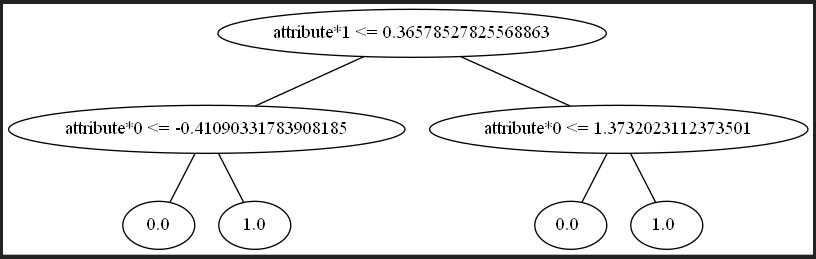

# Ensemble-Learning-Project

1. Decision Tree from scratch

Edit the input data in the main.py file and run the decision tree implementation.

- The tree can handle classification or regression tasks. In the main.py set task='classification' or task = 'regression' depending on the specific need

````
# Choose the task of the tree (either classification or regression)
task = "classification"
# task = "regression"
````

- The input data can be either a numpy array or a pandas dataframe. The prerrequisite is that the label is the last column.
  ````
  # ------------------------------------
  # Classification Test Data
  # -------------------------------------
  N = 2000
  X, y = make_moons(N, noise=0.2)
  y = np.reshape(y, (N, 1))
  data = np.append(X, y, axis=1)

  train_data = data[:1000, :]
  val_data = data[1000:1500, :]
  test_data = data[1500:, :]
  ````

- After creating the decision_tree object setting the max_depth and the min_samples and training:
  ````
  dt = DecisionTree(train_data, task, max_depth=3)
  
  # Train the decision tree with cross-entropy method
  dt.train()
  ````

  - The decision tree can be used for calculating the accuracy on a validation set
    ````
    acc = dt.accuracy(data_predict)
    print(acc)
    ````

  - Also it can be used for predicting on a testing set with
    ````
    data_predict = test_data
    predictions = dt.predict(data_predict, val='validation')
    ````
    
- With graphviz installed in the local environment, it can be used for visualizing the output tree, using the draw_tree function.
  ````
  # Draw the resulting tree
  dt.draw_tree()
  ````
  
  
  


